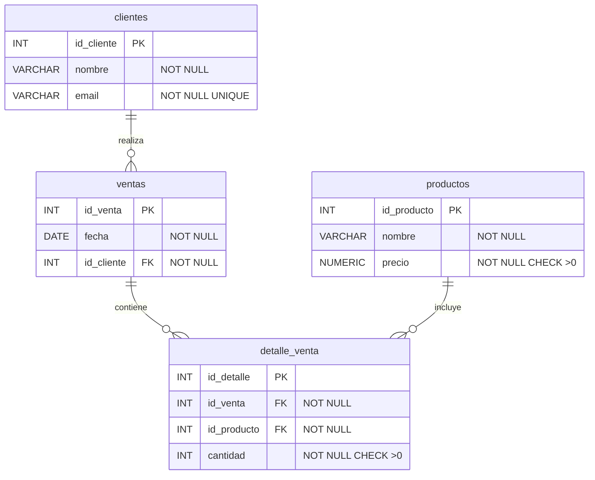

# Sistema de Ventas - Tienda de Tecnología

## 1. Descripción del proyecto

Modelamos un sistema de base de datos PostgreSQL para una tienda de tecnología que necesita registrar la información básica de sus operaciones. El sistema permite almacenar clientes registrados, productos disponibles, ventas realizadas y el detalle de productos vendidos en cada venta.

El problema que resuelve es poder responder preguntas reales de negocio como:
- ¿qué clientes compran más?
- ¿qué productos se venden más?
- ¿cuántas ventas se realizan?
- ¿qué ventas tienen más de un producto?
- ¿qué clientes han comprado varias veces?

### Diagrama entidad-relación



## 2. Tecnologías utilizadas

- PostgreSQL
- SQL (DDL, DML, Joins, Agregaciones)

## 3. Instrucciones de uso

```bash
# 1. Ejecutar schema.sql para crear la base de datos y las tablas
psql -U postgres -f schema.sql

# 2. Ejecutar seed.sql para poblar las tablas con datos de ejemplo
psql -U postgres -d postsql_sistema_ventas -f seed.sql

# 3. Ejecutar report.sql para correr las consultas del reporte
psql -U postgres -d postsql_sistema_ventas -f report.sql
```
